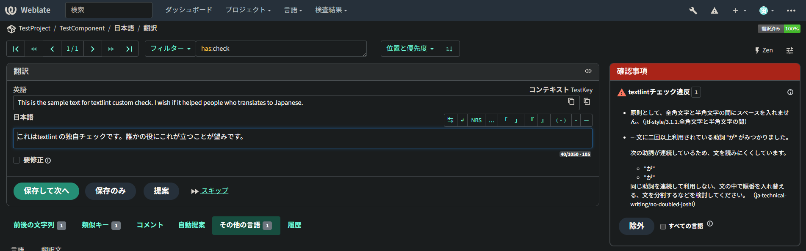
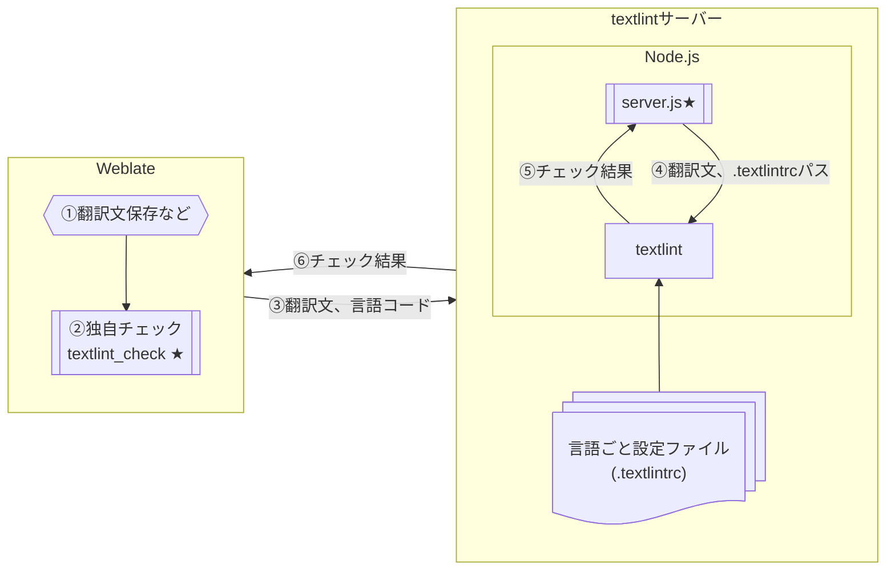
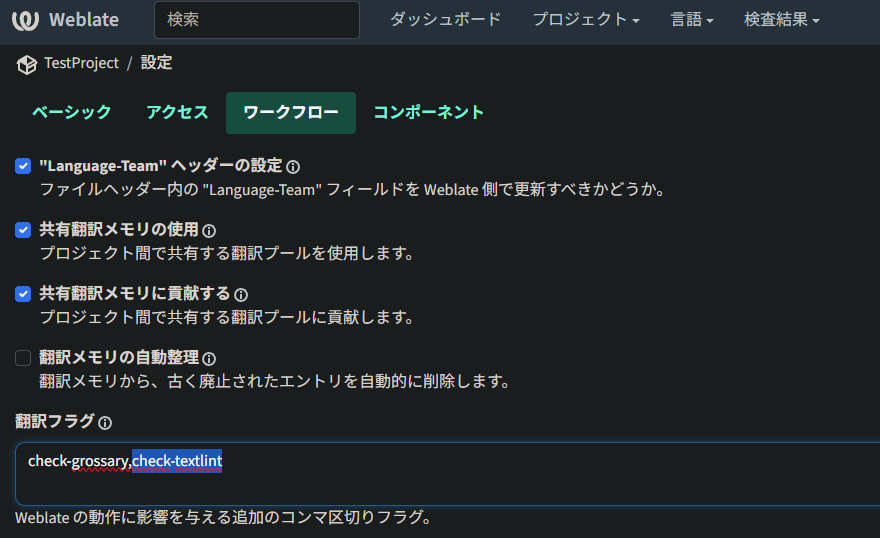

# textlintチェック for Weblate

[Weblate](https://weblate.org/)でtextlintと連携し翻訳文のチェックを行う独自チェックです。<br>
[JTF日本語標準スタイルガイド（翻訳用）ルールセット](https://github.com/textlint-ja/textlint-rule-preset-JTF-style)および[技術文書向けのtextlintルールプリセット](https://github.com/textlint-ja/textlint-rule-preset-ja-technical-writing)を用いた翻訳文のチェックを行います。



## 1. 動作イメージ
（★=本リポジトリで実装しているコンポーネント）

Weblateの独自チェックとtextlintは、WeblateサーバーとNode.js（Express.js）間のHTTP通信で連携します。textlintはコマンドラインではなくNode.js内で直接実行されます。

## 2. 注意事項

- PaaS、SaaS上で動作するWeblateサーバーでの使用実績はありません。ご利用は自己責任でお願いいたします。<br>
  もし使用上の問題点や改善案がありましたら、[Issues](http://github.com/h1data/weblate-check-textlint/issues)から報告いただければ幸いです。
- 自己ホスト型でない場合などWeblateの利用形態によっては、本チェックを利用できない場合があります。
- 翻訳文ごとにチェックするため、コンポーネント内の翻訳文をまたいだチェック（「ですます調」、「である調」の統一チェックなど）には対応していません。

## 3. 導入方法

### 3.1. 環境準備

Dockerおよびcomposeを行うための環境を準備します。以下の環境でのみ動作確認を行っています。
- [Podman Desktop](https://podman-desktop.io/) 1.24.2 + Compose extension
- Podman 5.7.1（Podman Desktopに同梱）
- Weblate 5.15.2（Dockerfileでバージョンを指定したイメージを取得）

### 3.2. リポジトリの取得

下記コマンドで本リポジトリの内容をチェックアウトします。
``` sh
$ git clone http://github.com/h1data/weblate-check-textlint
```

フォルダー構成を以下に示します。
```
root\
├─ textlint-server\               Node.jsコンテナ構成用フォルダー
│  ├─ textlint\
│  │  └─ ja\                      言語別設定フォルダー
│  │     └─ .textlintrc           textlintチェックルール設定ファイル
│  ├─ Dockerfile                  Node.jsコンテナ構成ファイル
│  ├─ package.json                依存するJavaScriptライブラリを記載
│  └─ server.js                   サーバープログラム
├─ weblate\                       Weblateコンテナ構成用フォルダー
│  ├─ customize\                  独自チェック用ソースフォルダー
│  │  └─ textlint\                 (Weblateの/app/data/python/customizeに格納)
│  │     ├─ textlint_check.py     独自チェッククラス
│  │     └─ textlint_client.py    textlintクライアントクラス
│  ├─ Dockerfile                  Weblateコンテナ構成ファイル
│  └─ settings-override.py        追加設定ファイル（追加チェッククラスを指定）
├─ docker-compose.yml             コンテナ群構成ファイル
└─ environment                    環境設定定義ファイル
```

### 3.3. 設定ファイル準備

#### 3.3.1. environment
コンテナ間で共有する環境変数を設定します。
本リポジトリでは、[Docker compose for Weblate](https://github.com/WeblateOrg/docker-compose)のenvironmentファイルに対し下記設定を追加しています。
``` sh
# TextLint Server for Custom Check Setup
TEXTLINT_HOST=textlint
TEXTLINT_PORT=4000
TEXTLINT_PATH=/lint
TEXTLINT_LANGS=ja
TEXTLINTRC_PATH=/app/textlint
```

- `TEXTLINT_HOST`: textlintサーバーのホスト名を指定します。（既定値: textlint）<br>
基本的に[docker-compose.yml](#333-docker-composeyml)で指定するtextlintサーバーのサービス名になります。
- `TEXTLINT_PORT`: textlintサーバーのポート番号を指定します。（既定値: 3000）
- `TEXTLINT_PATH`: textlintサーバーのURLパスを指定します。（既定値: /lint）
- `TEXTLINT_LANGS`: チェック対象の言語コードをカンマ区切りで指定します。（既定値: ja）
- `TEXTLINTRC_PATH`: textlint用設定ファイルの格納パスです。(既定値: /app/textlint) <br>docker-compose.ymlのtextlintサービスで定義されているボリュームの `target` で指定したパスに合わせる必要があります。
``` yaml
  textlint:
    build:
      context: ./textlint-server
      dockerfile: Dockerfile
    volumes:
    - type: bind
      source: ./textlint-server/textlint
      target: /app/textlint  # ←このパスに合わせる
```

#### 3.3.2. textlint-server\textlint\ja\\.textlintrc
textlint用の設定ファイルです。もし日本語以外のチェックを追加する場合は、`textlint-server\textlint\(言語コード)\.textlintrc`と言語ごとの設定ファイルを用意し、environmentファイルの`TEXTLINT_LANGS`に言語コードを追加します。(例: `TEXTLINT_LANGS=ja,chz`)

チェックルールを変更する場合、[JTF日本語標準スタイルガイド（翻訳用）](https://github.com/textlint-ja/textlint-rule-preset-JTF-style?tab=readme-ov-file#textlintrc%E3%82%92%E4%BD%BF%E3%81%86%E6%96%B9%E6%B3%95%E6%8E%A8%E5%A5%A8)や[技術文書向けのtextlintルールプリセット](https://github.com/textlint-ja/textlint-rule-preset-ja-technical-writing?tab=readme-ov-file#%E3%83%AB%E3%83%BC%E3%83%AB%E3%81%AE%E8%A8%AD%E5%AE%9A%E6%96%B9%E6%B3%95)のルールの設定方法を参考に本ファイルを変更します。
本リポジトリの`.textlintrc`では、Weblate標準の[終止符の不一致](https://docs.weblate.org/ja/latest/user/checks.html#mismatched-full-stop)チェックと内容が重複、あるいは競合する場合があるため以下のチェックを無効化しています。

- [技術文書向けのtextlintルールプリセット：文末の句点記号として「。」を使います (ja-no-mixed-period)](https://github.com/textlint-ja/textlint-rule-preset-ja-technical-writing?tab=readme-ov-file#%E6%96%87%E6%9C%AB%E3%81%AE%E5%8F%A5%E7%82%B9%E8%A8%98%E5%8F%B7%E3%81%A8%E3%81%97%E3%81%A6%E3%82%92%E4%BD%BF%E3%81%84%E3%81%BE%E3%81%99)
- [技術文書向けのtextlintルールプリセット：感嘆符!！、疑問符?？を使用しない (no-exclamation-question-mark)](https://github.com/textlint-ja/textlint-rule-preset-ja-technical-writing?tab=readme-ov-file#%E6%84%9F%E5%98%86%E7%AC%A6%E7%96%91%E5%95%8F%E7%AC%A6%E3%82%92%E4%BD%BF%E7%94%A8%E3%81%97%E3%81%AA%E3%81%84)

>【ヒント】本設定ファイルはtextlintサーバー（コンテナ）からホストのtextlint-server\textlint\ フォルダーの内容を直接参照します。
>ホスト側の設定ファイルを変更した場合、次回のチェックから反映されます。<br>
>ルールセットを追加する場合は、textlint-server\package.jsonの更新とコンテナの再ビルドが必要です。

#### 3.3.3. docker-compose.yml
[Docker compose for Weblate](https://github.com/WeblateOrg/docker-compose)のdocker-compose.ymlを元に、単一のWeblate、textlintサーバーが同一ネットワーク上で動作するよう構成しています。
他の設定ファイルに合わせた記載となっていますが、内容を変更する場合にはWeblateドキュメントの[Docker を使用したインストール](https://docs.weblate.org/ja/latest/admin/install/docker.html)を参照してください。

#### 3.3.4 docker-compose.override.yml
[Docker を使用したインストール](https://docs.weblate.org/ja/latest/admin/install/docker.html#installation)を参考にdocker-compose.ymlと同じフォルダーに作成し、環境や利用形態に応じてWeblateサービスのportsや`WEBLATE_ADMIN_PASSWORD`などの設定を指定してください。

### 3.4. コンテナの構成・起動
docker-compose.ymlがあるフォルダーで下記コマンドを実行し、コンテナ群を構成、起動します。
``` sh
$ docker compose up --build -d
```
起動完了後、`http://localhost:(docker-compose.override.ymlで指定したポート)`でWeblateの画面にアクセスできます。

### 3.5. 翻訳フラグの設定

textlintによるチェックを行いたいWeblateのプロジェクトもしくはコンポーネントに翻訳フラグ`check-textlint`を設定してください。
>【ヒント】設定済みの翻訳フラグがある場合は、カンマつなぎで追加します。例：`check-glossary,check-textlint`



>【ヒント】独自チェックの有効化やチェックルール変更後に既存の翻訳をすべて再チェックする場合は、Weblateコンテナ内のコンソールで下記コマンドを実行します。
> ``` sh
> $ weblate updatechecks --all
> ```

## 4. 補足: textlintサーバー通信仕様
### 4.1. サーバーURL
[環境変数](#331-envirionment)で指定したホスト名、ポート番号、およびパスを元にしたURL（本リポジトリの既定では`http://textlint:3000/lint`）で受け付けます。
### 4.2. チェック要求内容
POST方式でHTTPリクエストボディに翻訳文と言語コードをjsonで指定します。
```
{ text: "翻訳文を設定することができます。", lang: "ja" }
```
### 4.3. チェック応答内容
レスポンスボディにtextlintの結果がJSON形式で設定されます。
``` json
{
  "messages":
    [
      {
        "type":"lint",
        "ruleId":"ja-technical-writing/ja-no-redundant-expression",
        "message":"【dict2】 \"することができます\"は冗長な表現です。\"することが\"を省き簡潔な表現にすると文章が明瞭になります。\n解説: https://github.com/textlint-ja/textlint-rule-ja-no-redundant-expression#dict2",
        "index":6,
        "line":1,
        "column":7,
        "range":[6,7],
        "loc":{"start":{"line":1,"column":7},"end":{"line":1,"column":8}},
        "severity":2,
        "fix":{"range":[6,15],"text":"できます"}
      },
    ...
    ],
  "filePath":"input.md"
}
```
チェックエラーを検出した場合、独自チェックはチェック応答内容からmessageとruleIdをエラー内容の表示に使用します。
```
【dict2】 "することができます"は冗長な表現です。"することが"を省き簡潔な表現にすると文章が明瞭になります。
解説: https://github.com/textlint-ja/textlint-rule-ja-no-redundant-expression#dict2 (ja-technical-writing/ja-no-redundant-expression)
```
実行時エラーが発生した場合はHTTP 500を返し、エラー内容をtextlintサーバーの標準出力に出力します。

## 5. 参考資料
- Weblate
  - [独自の検査項目の作成](https://docs.weblate.org/ja/latest/admin/checks.html#own-checks)
  - [Weblate のカスタマイズ](https://docs.weblate.org/ja/latest/admin/customize.html)
  - [Docker を使用したインストール](https://docs.weblate.org/ja/latest/admin/install/docker.html)
  - [管理コマンド](https://docs.weblate.org/ja/latest/admin/management.html)
  - [Weblateソース](https://github.com/WeblateOrg/weblate)
  - [Docker compose for Weblate](https://github.com/WeblateOrg/docker-compose)
- Docker
  - [Dockerfile リファレンス](https://docs.docker.jp/engine/reference/builder.html)
  - [Compose ファイル リファレンス](https://docs.docker.jp/reference/compose-file/toc.html)
- textlint
  - [JTF日本語標準スタイルガイド（翻訳用）ルールセット](https://github.com/textlint-ja/textlint-rule-preset-JTF-style)
  - [技術文書向けのtextlintルールプリセット](https://github.com/textlint-ja/textlint-rule-preset-ja-technical-writing)

